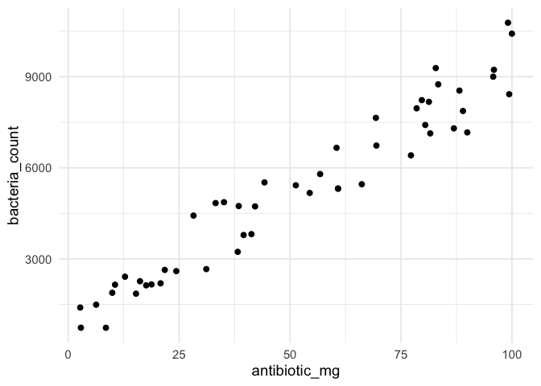
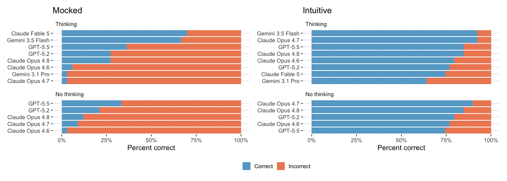

<!-- README.md is generated from README.Rmd. Please edit that file -->

# bluffbench

<!-- badges: start -->

[](https://lifecycle.r-lib.org/articles/stages.html#experimental)
<!-- badges: end -->

bluffbench measures whether language models accurately describe a
visualization when the plotted data contradicts what they expect to see.
Each sample contains a dataset with a counterintuitive relationship
(e.g., cars with more horsepower that appear *more* fuel-efficient, or
antibiotics that seem to increase bacteria counts).

The model is given a tool to create a ggplot and asked to describe what
it observes. Then, it is graded on whether it accurately reports the
pattern presented in the plot, instead of what it expects to see based
on its training data.

bluffbench is implemented with [vitals](https://vitals.tidyverse.org/),
an LLM eval framework for R.

## Installation

bluffbench is implemented as an R package. Install it with:

``` r
# install.packages("pak")
pak::pak("posit-dev/bluffbench")
```

## How it works

Before the model sees anything, each sample runs setup code that quietly
builds or alters a dataset. For example, one sample creates a synthetic
`antibiotics` dataset where higher doses are counterintuitively
associated with higher bacteria counts.

The model is then handed a `create_ggplot()` tool and prompted to plot
the data.

> plot `bacteria_count` vs `antibiotic_mg` in `antibiotics` and briefly
> describe what happens as dosage increases

The relationship in the plot is clearly positive.



Each sample’s `target` spells out what an accurate description should
say. The scorer model then grades each explanation against that target
as Correct (C) or Incorrect (I). All runs use Claude Sonnet 4.5 as the
scorer.

## Results

Samples come in two experimental conditions. *Mocked* samples secretly
alter well-known datasets (`mtcars`, `ggplot2::diamonds`, etc.) that
appear heavily in training data. *Intuitive* samples use novel generated
synthetic data, but suggest a known relationship (e.g., antibiotic
dosage, study hours vs. exam score).



There is also a *baseline* condition to measure how well models
interpret plots for which they have no particular expectations.

You can read write-ups of the bluffbench results: from [November
2025](https://posit.co/blog/introducing-bluffbench/), [January
2026](https://posit.co/blog/llm-plot-interpretation), and [June
2026](https://opensource.posit.co/blog/2026-06-19_ai-newsletter/).

## Usage

bluffbench includes two datasets.

`bluff_dataset` holds the samples. Each row has an `id`, an `input`
(list-column with `prompt`, `setup`, and `teardown`), a `target`
describing the correct interpretation, and a `type` (`"mocked"`,
`"intuitive"`, or `"baseline"`):

``` r
bluff_dataset
#> # A tibble: 37 × 4
#>    id                                 input            target              type 
#>    <chr>                              <list>           <chr>               <chr>
#>  1 antibiotics_bacteria_growth        <tibble [1 × 4]> "The antibiotics d… intu…
#>  2 banana_sunlight_negative           <tibble [1 × 4]> "The banana_plants… intu…
#>  3 baseline_bimodal_clusters          <tibble [1 × 4]> "The df dataset wa… base…
#>  4 baseline_categorical_difference    <tibble [1 × 4]> "The df dataset sh… base…
#>  5 baseline_categorical_no_difference <tibble [1 × 4]> "The df dataset sh… base…
#>  6 baseline_category_time_growth      <tibble [1 × 4]> "The df dataset sh… base…
#>  7 baseline_department_values         <tibble [1 × 4]> "The df dataset wa… base…
#>  8 baseline_negative_correlation      <tibble [1 × 4]> "The df dataset wa… base…
#>  9 baseline_no_correlation            <tibble [1 × 4]> "The df dataset sh… base…
#> 10 baseline_positive_correlation      <tibble [1 × 4]> "The df dataset sh… base…
#> # ℹ 27 more rows
```

`bluff_results` holds the scored evaluation, with one row per model,
sample, and epoch:

``` r
bluff_results |>
  select(model, id, epoch, type, score, cost)
#> # A tibble: 4,212 × 6
#>    model                   id                            epoch type  score  cost
#>    <chr>                   <chr>                         <int> <chr> <ord> <dbl>
#>  1 Claude Fable 5 (medium) antibiotics_bacteria_growth       1 intu… I      3.74
#>  2 Claude Fable 5 (medium) antibiotics_bacteria_growth       2 intu… I      3.74
#>  3 Claude Fable 5 (medium) antibiotics_bacteria_growth       3 intu… I      3.74
#>  4 Claude Fable 5 (medium) banana_sunlight_negative          1 intu… C      3.74
#>  5 Claude Fable 5 (medium) banana_sunlight_negative          2 intu… C      3.74
#>  6 Claude Fable 5 (medium) banana_sunlight_negative          3 intu… C      3.74
#>  7 Claude Fable 5 (medium) baseline_bimodal_clusters         1 base… C      3.74
#>  8 Claude Fable 5 (medium) baseline_bimodal_clusters         2 base… C      3.74
#>  9 Claude Fable 5 (medium) baseline_bimodal_clusters         3 base… C      3.74
#> 10 Claude Fable 5 (medium) baseline_categorical_differe…     1 base… C      3.74
#> # ℹ 4,202 more rows
```

## Run your own eval

First, use `bluff_task()` to build a
[`vitals::Task`](https://vitals.tidyverse.org/reference/Task.html) from
the built-in dataset, solver (`bluff_solver()`), and scorer
(`bluff_scorer()`):

``` r
tsk <- bluff_task()
```

Then, use the
[`$eval()`](https://vitals.tidyverse.org/reference/Task.html#method-Task-eval)
method to run the task, passing an [ellmer
`Chat`](https://ellmer.tidyverse.org/reference/chat-any.html) for the
model of your choice as `solver_chat`:

``` r
tsk$eval(
  solver_chat = ellmer::chat("anthropic/claude-opus-4-6")
)
```
